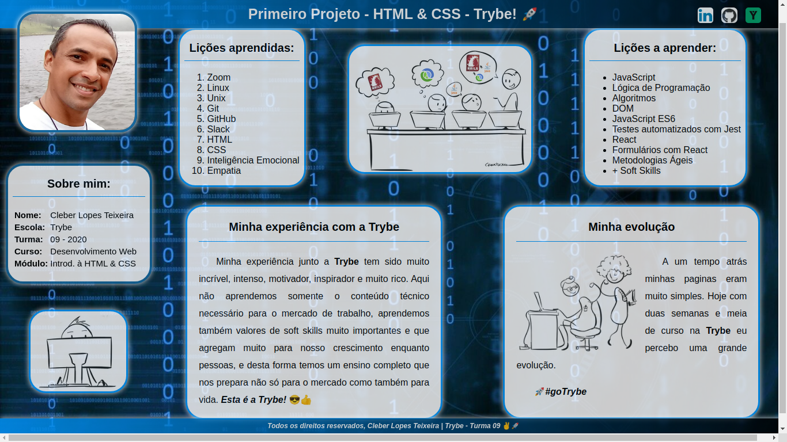

# Lessons Learned Project :books: :nerd_face:

### Projeto da Trybe 

- **Formação -** Desenvolvimento Web Full Stack

- **Módulo 01 -** Fundamentos do Desenvolvimento Web

- **Bloco 03 -** Introdução à HTML e CSS

  

  
&#x1F517 <a href="https://cleber-teixeira.github.io/projetos/lessons-learned/"> <b>Lessons Learned Project</b></a>

---
### Contexto :pencil:
Neste projeto é implementado:

 - As principais **tags HTML** para compor a estrutura de uma página, estilizando e alterando o posicionamento dos componentes através de CSS.
 - Neste projeto é criado uma página do zero utilizando HTML e CSS, com o objetivo de consolidar todo o conhecimento adquirido com a produção completa de um site.

---
### Técnologias usadas :computer:

 
  

  

 

Front-End:
> Html 5, CSS 3

---
### Executando  o Projeto :rocket:

> Diretório Raiz
- index.html

---
### Contatos  :email:
<h2 align="center">Cleber Lopes Teixeira</h2>

  

   
  
  <a href="https://github.com/cleber-teixeira">cleber-teixeira</a>

   
  
  <a href="https://www.linkedin.com/in/cleberlopesteixeira/">cleberlopesteixeira</a>

   
  
  <a href="mailto:cleberlt@gmail.com">cleberlt@gmail.com</a>

---
